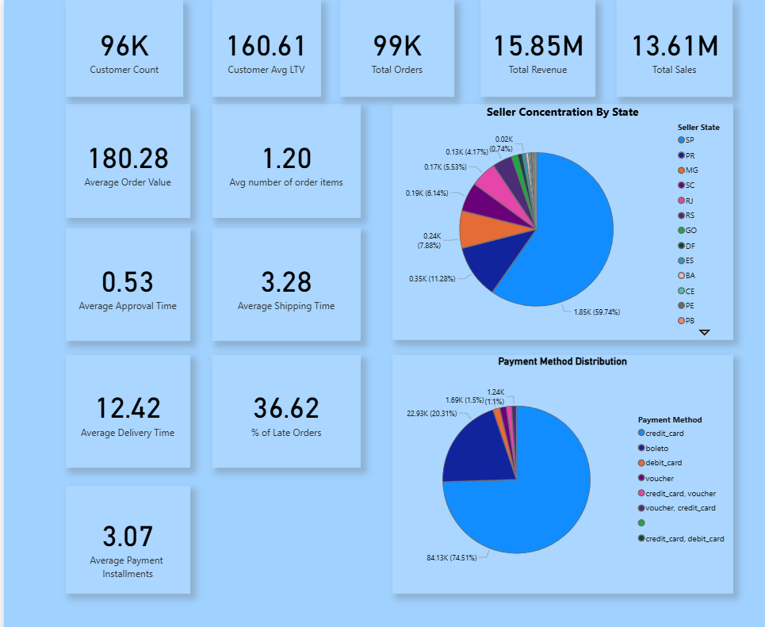
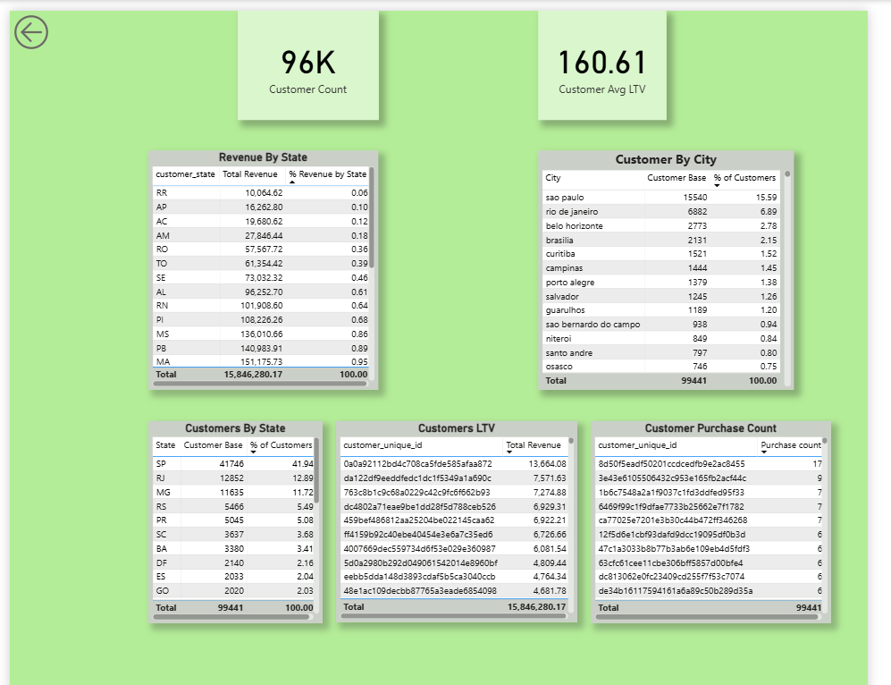
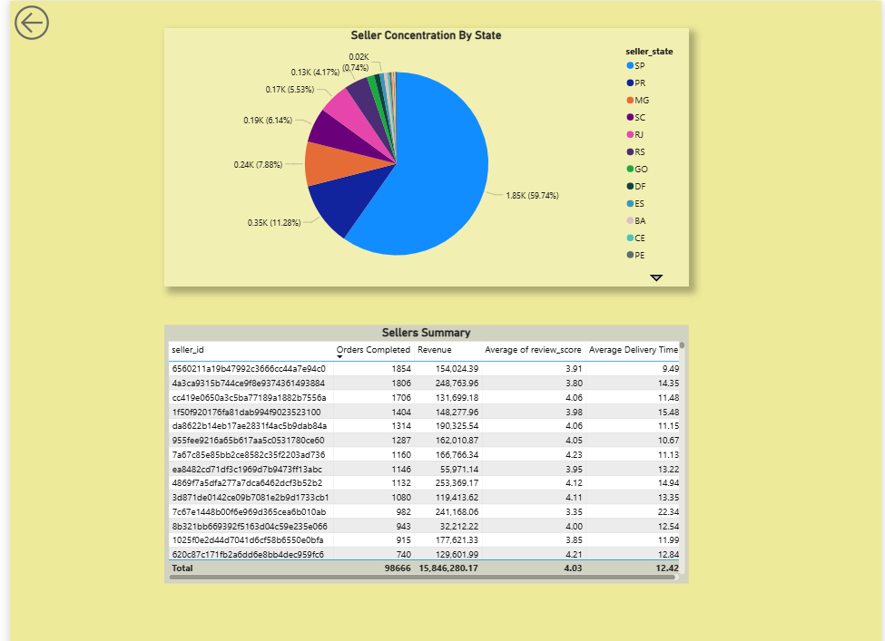
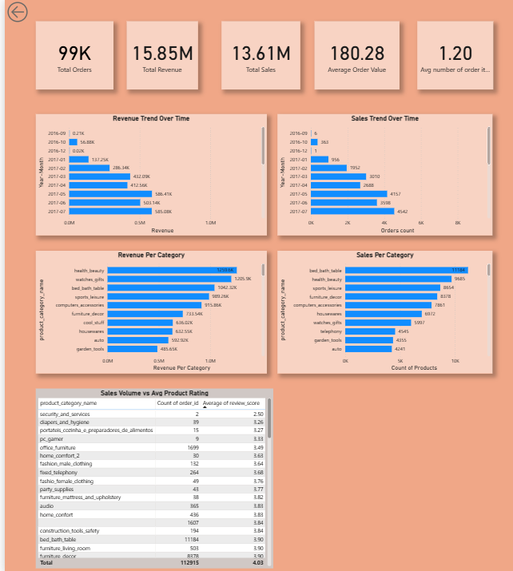
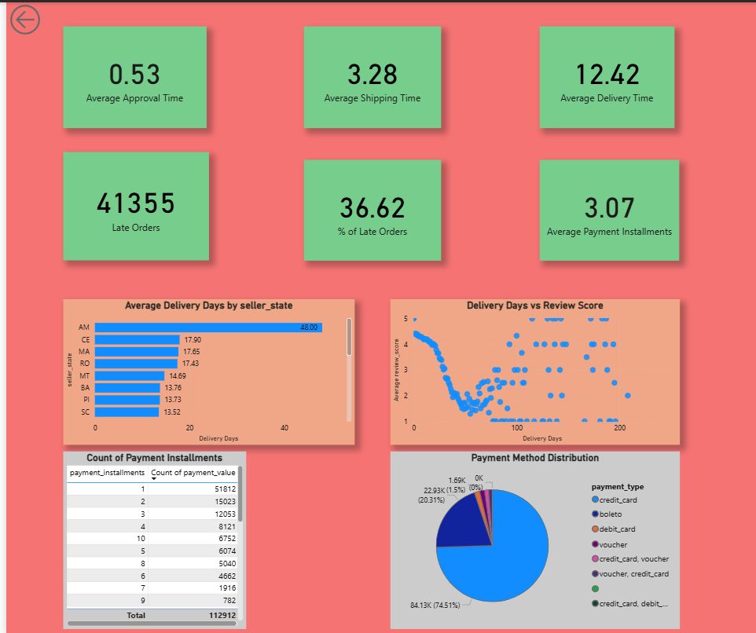

# Brazilian Ecommerce Data Analysis

## Project Highlights
- Analyzed 100K+ orders from the Olist marketplace.
- Built a star-schema data model.
- Developed SQL-based business KPIs.
- Created a 5-page Power BI dashboard.
- Identified customer concentration and seller dependency risks.
- Generated recommendations to improve delivery performance and customer growth.


## Table of Contents
- [Brazilian Ecommerce Data Analysis](#brazilian-ecommerce-data-analysis)
  - [Project Highlights](#project-highlights)
  - [Table of Contents](#table-of-contents)
  - [Overview](#overview)
  - [Project Objective](#project-objective)
  - [Repository Structure](#repository-structure)
  - [Dataset Description](#dataset-description)
  - [Tools Used](#tools-used)
  - [Methodology](#methodology)
  - [Analytical Model](#analytical-model)
  - [Key KPIs](#key-kpis)
  - [Key Findings](#key-findings)
  - [Recommendations](#recommendations)
  - [Power BI Dashboard](#power-bi-dashboard)
    - [1. Executive Dashboard:](#1-executive-dashboard)
    - [2. Customer Analysis:](#2-customer-analysis)
    - [3. Seller Analysis:](#3-seller-analysis)
    - [4. Sales Analysis:](#4-sales-analysis)
    - [5. Payment \& Delivery Analysis:](#5-payment--delivery-analysis)
  - [How To Use](#how-to-use)


## Overview
This repository contains an end-to-end analysis of the Brazilian e-commerce  **Olist** dataset. The dataset contains approximately two years of real-world transaction data from customers purchasing products through the Olist marketplace.

## Project Objective
The objective of this project is to analyze customer behavior, sales performance, seller distribution, payment trends, and delivery efficiency within the Olist marketplace to identify growth opportunities and operational improvements.

## Repository Structure
```
├── data_raw/
├── data_cleaned/
├── data_model/
├── sql/
├── notebooks/
├── powerbi_reports/
├── reports
├── docs/
├── images/
└── README.md
```

## Dataset Description
* The data for this analysis has been collected from **kaggle**.
* Link to dataset [here](https://www.kaggle.com/datasets/olistbr/brazilian-ecommerce)
* Its recommended to go through the page to understand the columns given and their meanings.
* A dataset_inventory pdf is available describing about the files & their columns which might not be direct to interpret.
* The file **dataset_inventory.pdf** consists of **inventory report** which provides a summary about the data available in various files.

## Tools Used
* Python
* SQL
* Power BI
* MS Excel


## Methodology
1. Data Profiling
   - Checked missing values, duplicates, and data types.

2. Exploratory Data Analysis (EDA)
   - Analyzed customer, seller, product, and order patterns.

3. Data Modeling
   - Created relationships between datasets using a star-schema approach.

4. SQL Analysis
   - Developed KPIs and business metrics.

5. Insight Generation
   - Identified trends, bottlenecks, and business opportunities.

6. Dashboard Development
   - Built an interactive Power BI dashboard.


## Analytical Model
* The below image is the schema diagram that has been used for modelling relationships with tables and building reports.


## Key KPIs
| Metric | Value |
|----------|---------|
| Total Orders | 99K |
| Total Customers | 96K |
| Total Sellers | 3095 |
| Average Order Value | $180.28 |
| Average Delivery Time | 12.42 Days |
| Late Deliveries | ~37% |


## Key Findings
* 	Customers concentration is high in certain states.
* 	6 states : SP, RJ,MG,RS,PR,SC cover 80% of entire customer base.
* 	Average retention period of customers is 3.69 days.
* 	Majority of customers are new customers as the majority retention period is 1 day.
* 	Average order value is 200$
* 	Avg approval time: 0.51 days
* 	Avg shipping time: 3.28 days
* 	Avg Delivery time : 12.42 days
* 	% of Late orders : ~37%
* 	Products sales are concentrated around certain products.
* 	The top sellers account for a significant share of total revenue, creating dependency risk and reducing marketplace resilience.
* 	Majority of transactions happen with credit card & wallet.

## Recommendations
* 	Increasing marketing spend in customer concentrated states.
* 	Increasing seller diversification.
* 	Improving partnership with the sellers in the concentrated states.
* 	Working to reduce delivery time.
* 	Strengthen partnership with payment partners.
* 	Providing more deals on the major purchased products.
* 

## Power BI Dashboard
* **Location**:powerbi/olist_dashboard.pbix
*  The dashboard contains:
   - Executive Overview
   - Customer Analysis
   - Sales Analysis
   - Seller Analysis
   - Delivery Analysis
   - Payment Analysis

* Below are the references of the pages in the report.
### 1. Executive Dashboard: 

### 2. Customer Analysis: 

### 3. Seller Analysis: 

### 4. Sales Analysis: 

### 5. Payment & Delivery Analysis:



## How To Use
1. Clone the repository.
2. Download data from [here](https://www.kaggle.com/datasets/olistbr/brazilian-ecommerce)
3. Review the notebooks for cleaning and EDA.
4. Open the SQL scripts for analysis.
5. Open `powerbi_reports/olist_dashboard.pbix` in Power BI Desktop.